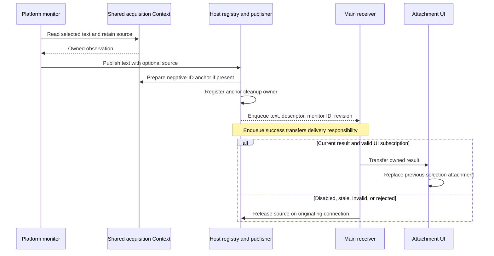

# Text Selection Monitoring

## 1. Purpose and Product Behavior

This specification defines automatic text-selection monitoring on Windows and macOS: process ownership, asynchronous settings interaction, filtering, source lifetime, and clipboard fallback. Its acceptance criteria define required behavior, not a claim that native E2E verification is complete.

The integration is currently dormant in production. Main does not register or subscribe the monitoring Watcher, and the related settings are not emitted into the settings UI. The RPC contracts, Watcher, Automation Host session support, platform monitor factories, attachment handling, and focused tests remain in the tree so the feature can be completed on its dedicated settings page without rebuilding the process-isolation path. Consequently, current builds do not start a text-selection monitor or produce automatic selection attachments.

A successful observation adds or replaces a draft text-selection attachment. The attachment represents captured text prepared for sending, rather than a live mirror of another application's selection. Clicking elsewhere, clearing the external selection, disabling monitoring, or failing to read text preserves the attachment. Users remove it explicitly; ordinary draft submission and clearing retain their existing behavior. There is no automatic empty-selection clearing outcome in this feature.

Automation Host owns gesture observation, debounce, target/filter checks, accessibility reads, clipboard fallback, and native cleanup. Main owns settings, asynchronous control, result acceptance, and attachments. Input Host owns shortcuts and shortcut recording. Agent text paging, screenshots, and particle effects have independent contracts. Linux is outside this process-isolation specification.

## 2. Ownership and the Shared Acquisition Context

| Owner | Responsibility |
| --- | --- |
| Main monitoring service (retained, not registered) | Saved enablement, acknowledged control, filter configuration, connection restoration, and one owning consumer |
| Automation session | One active monitor per authenticated connection; serialized start/stop/drain, source registration, and direct notifications |
| Platform monitor | Native hooks, one executing detection and one latest pending trigger, finite accessibility reads, and clipboard fallback |
| Shared acquisition Context | Identities and retentions for picker, text-selection, and other draft visual sources before chat association |
| Chat Context | Sources moved into the destination chat and its published Agent targets |

`ChatVisualService` owns the connection-restoring shared acquisition Context. Monitoring borrows it through a lease rather than creating a Context per subscription or gesture. Disabling monitoring does not dispose that Context. Attachment anchors retain their own parent leases and use the existing anchor-transfer path when moving into a chat.

Platform entry points construct the monitor factory alongside the Backend and picker resolver. Hosts do not initialize Main's DI graph. Reuse the session Backend rather than creating another accessibility client per detection. The Backend remains a non-retaining native service; it does not own the monitor or Context.

The Context operation queue is the concurrency boundary for identity maps, retention counts, and native elements. Acquisition, reads, adoption, and **all releases**, including cancellation or abandonment of an unsent source, execute through it. An atomic exchange of an ownership field does not make direct retention disposal outside that queue safe. Preserve this single serialization boundary rather than adding separate locks to Context internals.

The monitor owns unfinished attempts and untransferred observations. An anchor successfully enqueued for delivery belongs to the delivery path and can outlive monitor stop. Main releases rejected results; accepted attachments own their anchors.

## 3. Detection, Filters, and Native Threads

Windows uses the native hook helper's message-loop thread. macOS uses a native event-tap loop and Automation Host's AppKit bootstrap. Calls with native thread requirements use the appropriate existing loop; no Host path depends on Avalonia's dispatcher.

Hook callbacks capture bounded gesture state and schedule work. They do not query UIA/AX providers, wait for clipboard data, send RPC, or wait for async completion. Monitoring never consumes user input events.

Each monitor has one serial worker and one latest pending trigger. Capture target, gesture, cursor/clipboard evidence, and the attempt's cancellation token before asynchronous work begins. New relevant interaction invalidates superseded work. Debounce and clipboard waiting stay outside the Context queue; finite element operations and cleanup enter it. Native cancellation is cooperative between calls, with existing Host containment handling provider stalls.

### 3.1 User Configuration

The retained settings model stores these options for the future selection settings page and sends a complete configuration snapshot through the monitoring RPC control surface when the Watcher is registered. The production settings generator currently ignores these properties. Configuration describes the policy of an existing monitor; enablement remains a resource-lifecycle operation and is not a configuration field.

| Option | Behavior |
| --- | --- |
| Skip fullscreen applications | Enabled by default. Skip the entire detection, including accessibility and synthetic copy, when the interaction target is identified as fullscreen. Preserve existing attachments. |
| Applications excluded from automatic selection | Skip detection entirely for matching applications. |

The retained setting stores one application identity per line for a future editor. Commas are not separators because they are valid in application paths. Windows user rules support exact process-name or full executable-path matching using Windows comparison semantics. macOS uses application identity such as bundle identifier. No regex or scripting language is required. Platform compatibility rules remain implementation-owned and combine with user rules; clearing user rules does not remove a platform safeguard.

Recognized terminals default to accessibility-only detection. Process identity cannot identify every embedded terminal, so users can exclude affected host applications. A missing executable in a hard-coded list is not proof that Ctrl+C is safe. Where copy fallback is permitted, retain useful cursor heuristics, delayed-copy handling, and Ctrl+Insert-before-Ctrl+C behavior. Unsuccessful or forbidden copy strategies do not authorize reading unchanged clipboard content.

Host validates and acknowledges configuration updates. Main keeps only the latest configuration snapshot: repeated edits are coalesced, and the single watcher coordinator applies the newest snapshot after any in-flight start, stop, or update completes. Reconnection reapplies the latest saved snapshot. Applying a stricter rule invalidates affected unfinished work; recheck current target and current policy immediately before synthetic input. Configuration updates do not replay gestures, initiate copy attempts, or alter enablement.

### 3.2 Fullscreen Detection

The option concerns the window involved in the current interaction and its display, not any fullscreen window elsewhere on the desktop. Ordinary maximization is not sufficient evidence. Unknown or failed detection does not disable monitoring or produce a Toast; continue under the remaining application and copy-safety policies.

Check after a candidate gesture outside the hook callback and revalidate before synthetic copy. Avoid a long-lived result cache that remains stale after foreground/fullscreen transitions. Do not enumerate every window on every mouse event.

**Windows:** Identify the target top-level window and its display. Compare visible geometry against the full monitor rectangle (`rcMonitor`, not `rcWork`) in a consistent DPI coordinate space. `DWMWA_EXTENDED_FRAME_BOUNDS` avoids invisible resize borders included by `GetWindowRect`; account for their different DPI behavior. Styles, client bounds, and maximization state help distinguish ordinary maximization, but none is a universal fullscreen flag. Custom borderless fullscreen remains a bounded heuristic.

`SHQueryUserNotificationState` supplies supplemental system-level evidence: `QUNS_BUSY` includes fullscreen or presentation settings, `QUNS_RUNNING_D3D_FULL_SCREEN` denotes exclusive Direct3D fullscreen, and `QUNS_PRESENTATION_MODE` means presentation settings. These values identify neither the target window nor its display and must not alone suppress an unrelated ordinary window on another screen. Respecting presentation settings independently would be a separate product policy.

**macOS:** `NSApplication.currentSystemPresentationOptions` reports presentation options put into effect by the active application, including standard AppKit fullscreen. Associate this system signal with the current target; Everywhere's own window style or `presentationOptions` is not another application's state. Where window-level evidence is needed, the target AX window's `AXFullScreen` attribute may supplement it; unsupported/unavailable attributes are not a definitive negative. Geometry can supplement custom borderless fullscreen detection, but native layouts, coordinate systems, and notched displays make exact rectangle equality insufficient.

Do not use Dock window names such as `Fullscreen Backdrop` or private Spaces APIs for this feature. This contract does not change the separate Dock/activation behavior of Everywhere's own windows.

## 4. Dormant Main Integration and Retained Control Contract

There is currently no production control or startup restoration path. `AutomationTextSelectionWatcher` and `ITextSelectionWatcher` retain the following control contract, but neither is registered in Main's service collection. Re-enabling the feature requires a dedicated settings surface, production registration, one owning result subscription, and startup restoration; merely exposing the saved Boolean setting is insufficient.

Use the existing authenticated Automation connection and generated contracts. The process-wide Watcher exposes one non-concurrent `IAsyncRelayCommand<bool>` and the confirmed `IsEnabled` state. Settings persist that confirmed state; controls only observe it. Every settings view sees the same `IsRunning` value and operation result, including views created while a transition is already running.

The initiating control checks `CanExecute` and immediately awaits `ExecuteAsync`. The Watcher commits `IsEnabled` and the persisted setting only after interpreting the Host result. Expected rejection faults that execution with a structured local exception; the initiating control presents its localized message once. Unexpected failures propagate through the same task. A control does not own, cancel, or restore the operation when it leaves the visual tree.

| Operation | Completion meaning |
| --- | --- |
| Enable | Native listening is established with the latest configuration and Main's receiver is ready. Then the Watcher commits the enabled setting. |
| Enable rejected | Return a structured unsupported/permission/setup result, roll back partial setup, keep the switch off, and show one localized Toast. |
| Disable | Main invalidates local acceptance immediately. Host detaches hooks, cancels work, and finishes necessary cleanup before acknowledging completion. Then the Watcher commits the disabled setting. |
| Apply configuration | Main replaces the latest desired policy without changing enablement. If a monitor exists, Host accepts the newest complete snapshot; otherwise the snapshot is retained for the next start. |

Expected control failures are application results. Reuse `VisualElementQueryFailureKind` where appropriate and carry user-facing messages as `IDynamicLocaleKey`; Toast resolves once. Native HRESULTs, stacks, and provider details remain Host diagnostics. Unexpected RPC failures retain the existing exception protocol. Failure to create a selection listener does not close a healthy Automation connection.

```mermaid
sequenceDiagram
    participant UI as Settings UI
    participant M as Main monitoring service
    participant H as Automation Host
    UI->>M: Command(true)
    UI->>UI: Keep confirmed value; Command.IsRunning
    M->>H: Start in shared acquisition Context
    alt Native listener established
        H-->>M: Started
        M-->>UI: Watcher commits enabled setting
    else Unsupported or setup failure
        H-->>M: Explicit failure result
        M-->>UI: Stay off; show one Toast
    end
    UI->>M: Command(false)
    M->>M: Invalidate subscription acceptance
    M->>H: Stop addressed monitor
    H->>H: Detach hooks; cancel and finish cleanup
    H-->>M: Stopped
    M-->>UI: Watcher commits disabled setting
```

The toggle is a private implementation detail of each settings control. User input is immediately restored to the confirmed Watcher value while the shared command runs; only a Watcher property notification changes the displayed state. Configuration edits use a separate latest-value path and never execute the enablement command.

Restoration after a connection replacement has no initiating control. A definite unsupported or permission rejection commits the disabled state and raises one application-level notification for transient presentation. Temporary disconnection retains the confirmed enabled setting and produces no notification.

Main allocates a positive connection-scoped monitor ID. Repeating a start for the same identity and Context is idempotent; an old stop cannot disable a newer monitor. Start, stop, and drain share a serialized lifecycle: a replacement waits for its predecessor's cleanup, and repeated disposal awaits the same completion. Old and new instances therefore cannot overlap clipboard attempts.

Use the existing registry/handle machinery. `SafeHandle.Dispose()` queues release; it is not an acknowledgement of native cleanup. Normal user-driven stop needs awaitable completion backed by the same cleanup owner. Finalization and connection teardown remain fallback paths, without a separate registry or duplicate cleanup implementation.

Subscription identity remains valid through the UI dispatch boundary. A result posted before disable rechecks acceptance before changing attachments. Re-enabling establishes a new acceptance identity; an old monitor/result cannot attach to a new subscriber. Revisions order results within a monitoring lifetime. Successive valid observations may appear, but slower older completions cannot overwrite newer accepted results.

Connection replacement invalidates old resources. The watcher retains the confirmed feature enablement separately from the latest configuration and restores both, never old detection or synthetic input. Temporary disconnection alone does not erase user intent. Definite unsupported/permission failure during restoration disables the unusable setting and reports the failed transition once, instead of repeatedly destroying the Automation connection. Do not notify per read or per reconnect attempt.

Stop detaches hooks and signals cancellation before waiting for a provider call. Existing Host containment/shutdown deadlines bound uncooperative cleanup. Connection loss during stop keeps local acceptance invalid and leaves remaining resources to session teardown. On a live session, timeout is not proof that cleanup completed and does not permit an overlapping replacement.

## 5. Observation and Direct Delivery Ownership

Read accessibility text and retain its source during the same finite Context operation. `VisualElement.GetSelectedText(maxCharacters)` remains an explicit bounded read, not a Snapshot field or Agent paging operation. Exclude Everywhere's own UI using the authenticated Main PID, not the Host PID.

macOS retains the probed child that supplied text instead of later reacquiring the focused container. Clipboard text is observed later than the accessibility source: retained identity is not proof that a subsequent clipboard write came from that element. Attach a source only when target evidence establishes a reliable association. Trustworthy text without a reliable element is text-only; ambiguous text from unrelated clipboard writes is discarded. Main never substitutes a later focus query.

At most one unsent observation is retained. Its abandonment/replacement releases through the Context queue. Each phase has one cleanup owner:

| Phase | Cleanup owner |
| --- | --- |
| Source has not become an anchor | Observation owner, through its Context queue, including cancellation and early returns. |
| Context anchor preparation | The operation commits a complete anchor/descriptor or rolls back its mutation. Prepare fallible response data before committing ownership where possible. |
| Cleanup object submitted to `RegisterAsync` | Registry owns registration failure, release-before-registration, and teardown. The caller does not repeat disposal in another catch. |
| Registered anchor; serialization/enqueue fails | Publisher releases the local registry entry. |
| Notification successfully enqueued | Delivery path owns the anchor; Main releases on rejection or via its attachment. Connection teardown handles interrupted delivery. |

Host allocates a negative anchor ID from `RpcConnection`; Main uses the same Context lease, SafeHandle, and ReleaseQueue as for positive Main-requested IDs. The sign identifies the allocator, not resource location or release direction. Zero means no descriptor. A malformed positive pushed ID must not release an unrelated Main-allocated resource.



The connection-level receiver stays bound while monitoring is disabled. It assumes cleanup responsibility before acceptance checks and releases valid rejected descriptors even when their parent Context can no longer be wrapped. Delivery has one owning consumer; multicast observers cannot share one owning anchor. After enqueue, cancellation, stop, or a newer selection cannot make the sender reclaim the anchor. There is no follow-up fetch, claim, or application acknowledgement.

## 6. Results, Diagnostics, and Text Budget

### 6.1 Results and Diagnostics

| Situation | Product behavior |
| --- | --- |
| Nonempty observed text | Replace an existing selection attachment or add if capacity permits. Release rejected sources. |
| Empty selection, unsupported read, copy timeout, or inconclusive evidence | Preserve the attachment; no clearing notification. |
| Cancelled, superseded, filtered, or stale attempt | Preserve the attachment; release unconsumed resources. |
| Expected provider failure | Keep listening; any copy fallback still requires valid target evidence and policy. |
| Monitoring setup failure | Report once and keep/return the switch off without failing healthy Automation operations. |
| Connection loss | Invalidate old resources and restore saved intent through the connection lifecycle. |

Cancellation by supersession or stop is normal completion. Known access failure, provider timeout, and disappeared target retain Debug diagnostics; unexpected faults receive one Warning with exception and phase. Do not classify every `InvalidOperationException` as expected or erase diagnostics with a bare catch. Log application identity and phase, never selected text or clipboard content. Background read failures do not produce individual Toasts.

### 6.2 Text Budget and Future File Attachments

Derive the delivered-text budget from the effective ordinary RPC payload limit, reserving space for source metadata, MessagePack overhead, and safe padding. The current default payload ceiling is 1 MiB: a byte limit on the whole serialized message, not a UTF-16 character count. There is no portable 65,536-character platform selection limit on which this feature can rely.

The current ordinary-notification policy reserves 256 KiB for the envelope and source metadata, leaving at most 768 KiB of UTF-8 selected text. Native bounded reads may request up to the same number of UTF-16 code units before this byte check; reaching either boundary marks the attachment as incomplete. This is a transport policy rather than a claim about provider text length.

Agent-facing attachment markup emits `incomplete="true"` only for such a bounded prefix. Absence of that attribute means no limit was observed during capture; it does not promise that a faulty provider exposed all of its text.

Use one budget policy for accessibility and clipboard results. Use native bounded reads where supported, conservative character limits derived from UTF-8 size, and bounded variable-sized metadata. Ensure the complete serialized notification fits before enqueue and preserve Unicode boundaries. Reaching a read cap is not proof that the text ended; report truncation/incompleteness rather than presenting a bounded prefix as complete. Clipboard backup is independent and must not be truncated to this attachment budget.

Native selected-part limits and macOS's 32-child probe ceiling still bound operation count. Truncating after an API returns a complete string does not bound its initial allocation. Host containment remains the boundary for an uncooperative provider.

Automatic conversion of oversized pasted text and text attachments to temporary files is a future shared attachment capability. It will give the Agent a path for on-demand reads. Model-context thresholds are separate from transport limits. Preserving selection text larger than one RPC frame needs an explicit file/stream transfer and file lifetime policy; writing a truncated result to disk cannot recover missing text. This contract does not introduce that transfer path.

## 7. Clipboard Fallback and Platform Guarantees

Clipboard fallback is one finite Host operation: inspect intent and policy, back up supported content, validate target, send copy input, wait within a bounded policy, read a candidate, and conditionally restore. It is not a continuous clipboard-history listener or separate RPC calls for individual native steps.

Preserve useful cursor/copy heuristics, child probing, and Chromium/Electron accessibility activation. Hard-coded exceptions supplement user exclusions. If permitted strategies produce no copy evidence, return no result. In particular, failed Ctrl+Insert followed by forbidden Ctrl+C cannot fall through to reading old terminal clipboard content.

### 7.1 Evidence and Attribution

A changed sequence proves a change, not its association with this gesture. Use the attempt's baseline, current target, observed user-copy activity, and available owner identity. User and synthetic copies in the same application may have the same owner; neither platform returns our own per-copy transaction ID.

Associate content with the state observed for that read. Do not blindly adopt a newer sequence after an unrelated change or attach a retained source solely because its PID matches. Conflicting evidence abandons attribution. A trustworthy user copy may be used without simulating another; arbitrary clipboard changes cannot.

An application may write several times for one copy. A bounded settling interval can improve results but cannot prove final completion. Do not wait indefinitely or repeatedly synthesize input. After input is sent, key release and applicable cleanup run in finally even if publication is cancelled.

### 7.2 Windows Restoration

Windows provides an exclusive open-clipboard interval. Prepare recovery data, then:

1. Open the clipboard with a valid Host-owned HWND through appropriate native window/thread infrastructure.
2. While open, compare the current sequence with the state associated with the candidate result. If different, close without changing contents.
3. If equal, restore the supported backup or known originally empty state. Check native results and retain allocation ownership until transfer succeeds.
4. Close in finally.

The final check and `EmptyClipboard`/`SetClipboardData` belong to the same open interval. Checking before opening leaves an avoidable race. `OpenClipboard(NULL)` followed by `EmptyClipboard` leaves a null owner and cannot support the intended `SetClipboardData` restore. Reuse Host native infrastructure such as its message window rather than an Avalonia window.

Never keep the clipboard open while sending copy input or waiting for the target to write. Exclusive restoration prevents normal writes between the final check and replacement; it does not prove prior attribution, guarantee another application's attempted copy succeeds, or prevent a delayed write after close.

Backup remains best effort over text, DIB image, or file-drop data, in that priority order. Distinguish a known empty clipboard from backup acquisition failure; do not clear merely because backup could not be read. Unsupported additional formats do not automatically disable fallback, but restoring a supported value does not reconstruct every original format.

### 7.3 macOS Restoration

macOS preserves text through `NSPasteboard` and fixes the clipboard baseline in the gesture record. `changeCount` tracks ownership changes, not every individual data write or a copy transaction. The adopted public pasteboard operations do not provide Windows's exclusive check/restore interval. Check as close to restoration as possible and preserve detected intervening changes, retaining explicit best-effort semantics for the remaining check/write race.

Distinguish known emptiness from failed backup reads, restore only after establishing a copy result, and always release synthetic keys. Unsupported original formats remain outside the limited backup guarantee.

### 7.4 Guaranteed Behavior and Heuristics

| Concern | Boundary |
| --- | --- |
| Unchanged old clipboard text returned as a new copy | Preventable bug; require current-attempt evidence. |
| Overlapping Everywhere copy attempts | Preventable through serial detection and completed monitor handoff. |
| Windows write between final check and restore | Preventable within one successful exclusive clipboard interval. |
| Detected intervening copy | Preserve it; do not overwrite or reclassify its sequence as ours. |
| User copy versus synthetic copy in the same application | Heuristic; no per-copy correlation token from the target. |
| Final write of a delayed multi-write copy | Bounded heuristic, not a completion guarantee. |
| macOS compare-and-restore against other writers | Best effort; no equivalent exclusive interval in the adopted API. |
| Complete restoration of all formats | Outside the limited-format backup contract. |

## 8. Acceptance Evidence

Use focused ownership/control tests for deterministic contracts and manual Windows/macOS E2E for native behavior. Compilation and mocked RPC results do not establish provider, fullscreen, or clipboard behavior.

- Positive/negative IDs coexist; zero is invalid; release-before-registration works; negative anchors support snapshot, capture, Context move, and release.
- Registration failure has one cleanup owner; enqueue failure rolls back; abandoned retention release is serialized with concurrent picker operations in the shared Context.
- Enable/disable is acknowledged, UI is busy, setup rejection shows one Toast and stays off, repeated stop awaits the same cleanup, and start/stop/drain never overlap copy attempts.
- Disable after posting a result to the UI queue, then re-enable: the old result cannot update the new subscription. Accepted anchors survive monitor stop; rejected anchors release on the original connection.
- Empty/failed reads preserve attachments. Successful text can replace an existing selection attachment at capacity; rejected additions release their source.
- Name/path/bundle exclusions, precedence, terminal accessibility-only defaults, embedded-terminal manual exclusions, and policy changes before synthetic input behave as specified.
- Fullscreen browsers, video, games, native macOS fullscreen, ordinary maximization, transitions, mixed DPI, notched displays, and multiple displays with unrelated fullscreen windows exercise the filter. Unknown evidence does not disable the feature.
- Drag, double/triple click, Shift-click, child selection, and Chromium/Electron activation work. Target changes during debounce/read/copy do not misassociate text and source.
- Unicode text near the serialized-message limit is bounded through both accessibility and clipboard paths; incompleteness is explicit and supported backups are not truncated.
- Failed Ctrl+Insert with forbidden Ctrl+C produces no stale result. Exercise concurrent user copy/cut/paste, unchanged clipboard, delayed writers, empty originals, non-text formats, and backup failure.
- Windows restoration uses a valid HWND and rechecks under the open clipboard; native allocations are cleaned correctly. macOS conditional restoration and cancellation key-up remain best effort as specified.
- Elevated/ordinary targets, setup permission denial versus later provider failure, Input Host shortcuts, and Host shutdown/restart during detection/copy retain the intended boundaries.

## 9. Platform References

- [Windows notification states](https://learn.microsoft.com/en-us/windows/win32/api/shellapi/ne-shellapi-query_user_notification_state) and [SHQueryUserNotificationState](https://learn.microsoft.com/en-us/windows/win32/api/shellapi/nf-shellapi-shqueryusernotificationstate).
- [Window bounds and DPI](https://learn.microsoft.com/en-us/windows/win32/api/winuser/nf-winuser-getwindowrect) and [monitor/work-area rectangles](https://learn.microsoft.com/en-us/windows/win32/api/winuser/ns-winuser-monitorinfo).
- [macOS active system presentation options](https://developer.apple.com/documentation/appkit/nsapplication/currentsystempresentationoptions) and [AppKit fullscreen](https://developer.apple.com/library/archive/documentation/General/Conceptual/MOSXAppProgrammingGuide/FullScreenApp/FullScreenApp.html).
- [Windows OpenClipboard](https://learn.microsoft.com/en-us/windows/win32/api/winuser/nf-winuser-openclipboard), [SetClipboardData](https://learn.microsoft.com/en-us/windows/win32/api/winuser/nf-winuser-setclipboarddata), and [clipboard sequence semantics](https://learn.microsoft.com/en-us/windows/win32/api/winuser/nf-winuser-getclipboardsequencenumber).
- [macOS pasteboard change count](https://developer.apple.com/documentation/appkit/nspasteboard/changecount) and [UIA caller-selected text limits](https://learn.microsoft.com/en-us/windows/win32/api/uiautomationclient/nf-uiautomationclient-iuiautomationtextrange-gettext).
