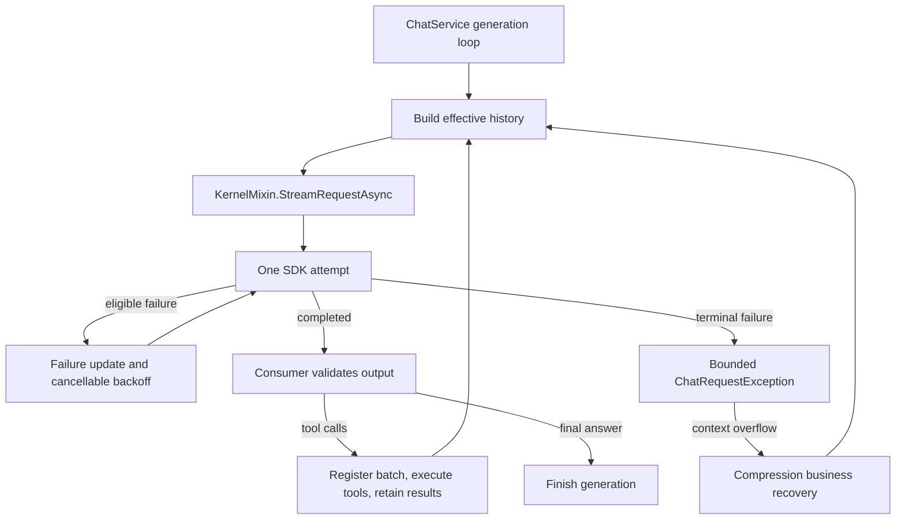

# Logical Request Execution

Status: implemented on 2026-10-03. The common read-idle timeout remains a separate,
undecided configuration change; current response-wait/SDK timeout behavior is retained.

## Ownership

A turn contains multiple logical requests and tool batches. One enumeration of
`StreamRequestAsync` owns exactly one fixed-input logical request and its attempts.
The executor never invokes tools, changes the chat graph, or compresses history.
Callers supply tool settings with automatic invocation disabled.

The executor snapshots the history container and execution settings. Each SDK
attempt receives another container/settings clone. Message contents remain shared
read-only objects; this is not a generic deep-copy facility. The input is never rebuilt
from the preceding attempt's provisional answer.

## Ordered streaming contract

`ChatRequestUpdate` contains `AttemptStarted`, `Content`, `AttemptFailed`, and
`Completed`. Contents retain the SDK `StreamingChatMessageContent` representation.

After `AttemptFailed` with a retry delay, the consumer closes statistics and resets
its provisional output. The next enumeration move performs the delay before starting
another SDK attempt. With no retry delay, the next move throws `ChatRequestException`.
This gives attempt statistics one closure event and the generation owner one terminal
exception path. A failure selected before a late cancellation retains its diagnosis.

Caller cancellation throws cancellation directly. Consumer abandonment disposes the
SDK enumerator and never initiates recovery. Consumer/UI/blob/statistics errors are
outside the SDK catch boundary and cannot cause an API replay.

`Completed` is stream completion, not business approval. Explicit finish metadata is
retained as `ChatResponseCompletion.RawReason`; missing/unfamiliar reasons retain
compatible behavior. Known truncation/filter reasons suppress the main response's
tool calls. Compression rejects an explicitly incomplete summary. No blanket finish
reason whitelist or new raw SSE parser is introduced.

## Retry policy

`Assistant.RequestMaxRetries` defaults to 5, meaning one initial attempt plus five
retries. Zero disables recovery; -1 retries eligible failures until stopped. The
factory captures this immutable value alongside the existing connection snapshot.
`ChatRequestOptions` allows a local override; connectivity uses zero.

Only `HandledChatException.Recovery` returning `ChatExceptionRecovery.Retry` repeats unchanged input. Context recovery returns
to ChatService/compression. Authentication, unsupported parameters and other permanent
failures terminate even with an unlimited budget.

Local backoff starts at approximately one second, doubles with a 0.8–1.2 jitter factor,
and caps at 30 seconds. A valid longer server delay wins. Long server delays are awaited
in bounded timer segments, all using caller cancellation. OpenAI Chat/Responses use
`ClientRetryPolicy(0)` and Anthropic uses `MaxRetries = 0`; their SDK defaults no longer
multiply the application budget. Official authentication refresh may still resend HTTP
within one SDK attempt, so attempt count is not a universal physical-send counter.

## Consumers and provisional output

ChatService has two consumers: visible span streaming and non-visible response
assembly. Both use the `RequestStatistics` scope. Each attempt starts and finishes
one invocation record, with its own usage and first-effective-output timing. Failed usage remains
accounted; context-usage decisions receive only the final accepted attempt's usage.

The visible consumer checkpoints the source span count and message metadata. Before
replay it removes the added suffix, restores metadata, and resets the tool builder and
temporary argument activity. Earlier accepted requests/tool results remain intact.
Removed image references follow existing blob ownership; rollback does not delete
shared blob files. Presentation prunes removed output/activity/group cache identities
while retaining surviving rows. Terminal failure/cancellation keeps useful active text
without accepting incomplete tool calls.

The assembled consumer resets its text/tool builders before replay. Compression and
topic generation use it instead of maintaining separate SDK loops. Compression only
trims input after a context-overflow diagnosis; a network retry does not trim history.
The current branch has no `ToolApprovalReviewer`; existing human consent remains the
tool's workflow. A restored reviewer should use this reader and keep its file-read and
missing-decision budgets outside transport attempts.

## Attempt accounting

Each SDK attempt retains its own invocation identifier, timing, reported usage and
success/failure status through RequestStatistics. Retries close the failed attempt
before opening another one. Existing assistant-message usage and statistics storage
remain in use; this change does not introduce new usage owners or footer aggregation.

## Operation, presentation and diagnostics

`ChatContext.TryExecute` and awaited `ExecuteAsync` share one busy/cancellation owner.
Parent cancellation reaches a child; child-only stop does not cancel its parent.
Generation returns `ChatGenerationResult` identifying the actual final assistant
message after compression and its terminal cause. Subagents return that final text,
or a tool failure carrying useful partial output rather than apparent successful text.

Each visible request lazily owns one `IBusyActivity` returned by
`ChatPresentation.SetBusyActivityAsync`, sharing the path used by MCP startup and
tool-argument generation. The implementing `BusyActivityItemPresentationRow` owns both
operation state and fixed placement/retention, without a separate activity wrapper.
Templates bind directly to the row; callers see only the operation interface.
Compression explicitly supplies its action message, and topics have no visible retry row.

The context presentation stores activities by owning message node. Each partition's
`TurnDescriptor` includes its assigned activity view, so window materialization does not
repeat a global membership search. The materialized turn owns completion subscriptions
and reconciles its own groups/pending state. It detaches subscriptions at completion,
source replacement or turn disposal. Icon/header changes need no structural refresh.
A one-shot completion callback releases removable rows from node storage and the current
descriptor view even when the turn is outside the window; it does not globally repartition.
The callback is released at completion or context disposal. Disposing an operation does
not destroy a retained row or its delayed group transition, and late updates cannot
restart it. Empty pending presentation is suppressed while an activity is running.

Function-call and reasoning templates likewise observe their source messages/spans
rather than row property forwarding. Reasoning liveness combines the owning assistant's
busy state and the span's completion time. Shared activity getters remain available to
the C# grouping algorithm, without forwarding change notifications. Source changes
reconcile projection structure without refreshing every activity row. Footers retain the existing assistant-message statistics and completion bindings.

The retry activity is removed at the first effective output (text, reasoning, tool updates,
or binary output), or on terminal failure/cancellation/abandonment. A later stream failure
creates another activity. Metadata-only and usage-only frames neither start output timing
nor end the retry indication. There is no retry-specific presentation row or lifetime scope.

`ChatRequestException` retains at most the last ten attempt errors and a total count.
Success and cancellation release provisional records. `AssistantChatMessage.Error`
is runtime-only, ignored by MessagePack and JSON; `ErrorMessageKey` remains persistent.
The error details action opens a lazy selectable/copyable dialog with a 65,536-character,
48-node and 8-level formatting budget. Request IDs, statuses and classification evidence
are available without adding request credentials/prompts to diagnostics. Retaining raw
exceptions can still retain large SDK object graphs independently of display limits.

Assistant and compression messages persist `IsCanceled`. Cooperative cancellation
propagates after setting the stopped outcome and ordinary finally cleanup. It does not
become an assistant error banner or a successful empty-response row. Continue keeps
the existing append behavior and earlier committed tool pairing.

## Verification boundary

The 2026-10-03 Release verification passed 388 AI tests with zero skips (286 real-HTTP
cases and 102 local normalization cases), plus 84 focused Core tests. Windows Release
build completed with zero errors and eight Watchdog AOT/trim warnings. New UI text is
provided in all 13 locales. See [Testing.md](Testing.md#request-execution-verification).

Real-HTTP tests instantiate the six production mixins and assert retry/send counts,
stable input, exhausted diagnostics, cancellation, early disposal, context recovery
and explicit output limits. Headless Core tests cover provisional output/metadata
rollback, retained tool results, per-attempt statistics, cache pruning, retry row identity,
stopped-message reload, parent/child cancellation, first-effective-output timing, SDK Activity parentage and bounded details formatting.

Native dialog/layout/copy interactions and a full tool-driven subagent generation
through compression still require application-level verification. Common read-idle
timers are not enabled by this implementation.
