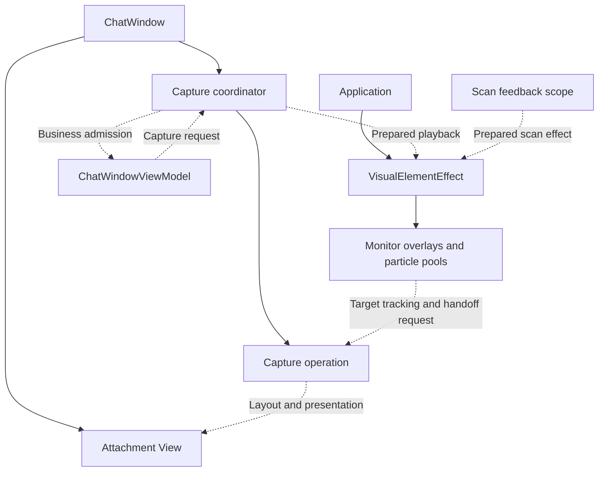

# Visual Element Effects: Capture and Scan Lifecycle

Status: implemented on 2026-09-28; native frame-by-frame validation remains pending.

This specification covers the existing element capture and visual-context scan effects. It follows the current implementation inspected on 2026-09-27 and the agreed ownership and handoff design. Section 12 records the confirmed request and sending policies.

## 1. Outcome and scope

A captured element flashes at its screen location, then flies into an attachment whose layout expands during flight. The destination becomes visible only when the particle is aligned and ready to hand over. Reusing an overlay window or pooled particle must not expose the previous capture.

The attachment becomes valid business data when the VM accepts it. Successful animation is not a condition for sending or retaining that attachment. Cancellation ends the visual transition without undoing an accepted business result.

Attachments belong to the chat input area. Sending uses the attachment list at the instant of sending. A capture still being prepared is independent of that send and of conversation selection; if it is admitted later, it joins the then-current input list and is not retroactively attached to an earlier message.

The implementation:

- Give `ChatWindow` ownership of capture coordination.
- Keep a shared application-owned effect host for capture and scan rendering.
- Move attachment animation state from the attachment model into the attachment View.
- Make target handoff and overlay reuse aware of rendering completion.
- Remove the visual-context builder's dependency on a View-owned scan scope and close the scan producer lifecycle.
- Adjust the existing spring separately after lifecycle correctness is verified.

The implementation preserves the existing particle controls, cross-monitor overlays, real attachment layout, early expansion, target occlusion checks, and `ChatAttachmentSizeTransitionContainer`. Thumbnail sizing, stretch, and aspect-ratio cropping are unchanged. File screenshot capture, text-selection attachment policy, and unrelated attachment flows are outside this refactor.

There is no generic transition engine, handler registry, event choreography, transition merging system, or new dependency/package in this design.

## 2. Current implementation and migration anchors

| Current code | Relevant responsibility or issue |
| --- | --- |
| `src/Everywhere.Core/Views/Effects/VisualElementEffect.cs` | Owns overlays, particle pools, pick playback, and bounded scan-consumer scopes. It receives prepared pixels and has no ChatWindow dependency. |
| `src/Everywhere.Core/Views/Chat/ChatVisualElementCaptureCoordinator.cs` | Owns picker/acquisition, capture preparation, attachment admission coordination, and presentation handoff for one ChatWindow. |
| `src/Everywhere.Core/ViewModels/ChatWindowViewModel.cs` | Owns attachment policy and exposes one window-bound capture delegate; it no longer drives effect preparation or playback. |
| `src/Everywhere.Core/Views/Chat/ChatWindow.axaml.cs` | Provides target access and native visibility/occlusion checks. Normal close cloaks the persistent window; actual close normally means shutdown. |
| `src/Everywhere.Core/Views/Chat/ChatAttachmentItemsControl.axaml.cs` | Owns the View-side pending/accepting presentation map, reads real bounds, starts layout acceptance, and reveals targets. |
| `src/Everywhere.Core/Views/Effects/VisualElementParticleHost.cs` | Makes pooled controls visible before spawning and immediately recycles completed particles. |
| `src/Everywhere.Core/Views/Effects/VisualElementEffectWindow.cs` | Immediately hides an idle native overlay. |
| `src/Everywhere.Core/Automation/VisualQuery.cs` | Collects observed top levels and optionally delivers owned captures after traversal. |
| `src/Everywhere.Core/ProcessIsolation/Automation/*` | Streams scan captures and the final query result from the Automation Host to Main. |

Target reveal now waits for a composition batch's rendered completion before the shared operation retires, and an idle overlay renders its cleared state before hiding. Overlay arrangement creates and positions native windows without showing them until a prepared particle is added. Native frame-level validation is still required because separate native windows cannot provide an atomic cross-window handoff.

## 3. Ownership

### 3.1 Application-owned rendering host

Keep `VisualElementEffect` as the shared rendering host and remove its constructor dependency on `IVisualElementAnimationTarget`.

It owns:

- Monitor placement and overlay native-window lifetime.
- The existing pick and scan particle hosts and pools.
- Safe preparation, reveal, and clearing of overlay contents.
- Rendering completion associated with overlay cleanup.

It receives prepared content and the capture operation's particle-facing target contract. It does not select a chat session, add attachments, change input state, or locate a global `ChatWindow` through DI. Preparing overlay placement does not reveal retained native content.

### 3.2 Window-owned capture coordination

Introduce one concrete `ChatVisualElementCaptureCoordinator`, privately owned by `ChatWindow`, under the View layer. Names in this specification describe intended contracts and may be shortened during implementation without changing their ownership.

The coordinator organizes selection, capture, temporary window hiding, attachment admission, visual registration, animation startup, cancellation, and handoff. It uses the window and its existing attachment controls directly. It is not registered as an application singleton.

The coordinator lives as long as the persistent window. Cloaking cancels relevant active presentations but does not dispose the coordinator. Actual closing unbinds requests, cancels preparation and active operations, and releases owned references. Overlay shutdown belongs to the application-owned host.

### 3.3 VM-owned business rules

The VM continues to own attachment construction/admission policy, duplicate and count checks, conversation selection, editing, and sending.

Factor the existing checks into narrow production methods used by the coordinator. Admission must repeat duplicate/count checks against the current input list after asynchronous preparation and immediately before insertion. The final check and insertion execute together on the UI thread without an intervening await. There is no captured conversation identity or draft revision to validate.

The source attachment collection is authoritative for membership. The dispatcher-observed collection and container lookup are presentation projections, not proof that an accepted attachment has been removed.

### 3.4 One shared capture operation

Evolve the existing shared `AttachmentTargetTracker` into one internal operation for an accepted animated capture. All monitor copies reference that operation.

It holds the attachment identity, captured source geometry, access to the owning input View, and the progress needed for acceptance, handoff, and cancellation. The coordinator tracks live operations only until cleanup finishes.

Particle controls retain their movement and appearance calculations. They request acceptance and report readiness to hand over through the shared operation. They cannot independently reveal the target or finalize the operation.

The operation is not reused with the particle pool. Late asynchronous continuations must verify that their operation is still active. No global request ID registry is needed; object identity and the actual owner lifetime are sufficient.



## 4. Entry points and asynchronous boundaries

Keep the existing command and hotkey entry points. Replace their calls into concrete View effects with one internal single-recipient, awaitable capture delegate, bound by `ChatWindow` during its existing initialization and cleared on actual close. Do not use an asynchronous multicast event.

The request distinguishes the two real entry modes: automatic capture of an already known element and explicit interactive picking. An activation without an element remains ordinary window activation. Existing settings continue to determine automatic capture and animation eligibility.

The request task completes after admission and animation startup, or after rejection/cancellation and preparation cleanup. It does not wait for the flight or scan animations to finish. The window retains responsibility for live animation operations and observes their asynchronous work with the existing `TaskExtensions.Detach` convention.

The preloaded window binds the delegate before registering capture shortcuts. A request after actual close must not create hidden work or be reported as a successful capture. Do not add a second fallback orchestration path in the VM.

All window, operation, collection-admission, and presentation state is UI-thread-owned. Element inspection, capture, and scan traversal may run off-thread. Marshal results once at the UI boundary. The scan queue is an actual producer/consumer boundary; capture presentation needs no locks or concurrent collections.

## 5. Capture preparation and admission

1. Preserve existing activation/session policy, including `AlwaysStartNewChat` eligibility. Keep that business decision separate from merely restoring a native window; never execute it again from a late animation callback. A capture does not reserve a conversation or a message.
2. Perform inexpensive count/duplicate checks where possible.
3. For interactive selection, remember the window's previous visibility and temporarily cloak it before invoking the existing picker. Ordinary user hiding and this local preparation step have different meanings; avoid a new global hide-reason protocol.
4. Create the candidate attachment and capture its bitmap and source screen bounds before restoring a window that could cover the source. Preserve existing preparation time bounds.
5. On the UI thread, check that the owning window is still alive and revalidate admission rules against the current input list. If animation is available, register the attachment as pending in the attachment View before inserting it into the source collection.
6. Insert the attachment without an intervening await. If admission fails, remove any pending presentation registration and release the unaccepted snapshot.
7. Restore/show the window as appropriate, prepare particle content and initial layout while non-drawing, and start the stationary flash immediately after startup is ready. Do not add an artificial preparation delay.
8. End the command request while retaining the live capture operation.

If the animation is disabled or snapshot/effect preparation fails, valid attachment admission uses normal presentation. A cancelled selection adds nothing. Recoverable visual failure is not a reason to reject an otherwise valid attachment.

Preparation failure or picker dismissal restores a previously visible window unless a later user action or shutdown superseded that restoration. A late callback must not reopen a window the user subsequently hid.

```mermaid
sequenceDiagram
    participant C as Coordinator
    participant V as VM
    participant T as Attachment View
    participant H as Effect host
    C->>V: Apply activation policy and create candidate
    C->>C: Select if needed, then capture source
    C->>T: Register pending presentation
    C->>V: Revalidate and admit candidate
    V-->>T: Collection projection eventually creates container
    Note over T: First container starts hidden and collapsed
    C->>H: Initialize particle without drawing old state
    C->>C: Restore the destination window
    C->>H: Reveal prepared particle and flash at source
    Note over C,H: Request ends; operation remains active
```

## 6. Attachment presentation and flight

Remove `VisualElementAttachment.PickState` and its model enum. Keep attachment identity, data, and `PreviewImage` on the existing model.

`ChatAttachmentItemsControl` owns a small reference-keyed mapping for attachments participating in a capture. It is the single source of presentation state. Its presenter applies that state when generating/reusing containers and when a state changes. Ordinary attachments require no mapping or wrapper object.

| Presentation | Layout | Drawing | Interaction |
| --- | --- | --- | --- |
| Pending | Collapsed | Hidden | Disabled |
| Accepting | Included | Hidden | Disabled |
| Normal, with no registration | Included | Visible | Normal |

Pending registration is independent of container creation. Reapplying a template reuses the owning control's registration; reused containers reset to the state of their current item. Actual target teardown ends the associated operation and releases its registration. Removing a container is not itself proof of business removal during a template rebuild.

After the stationary flash, start acceptance as soon as the target container is available. This expands the real layout while the particle is flying. Continue reading actual target screen bounds. Retain the existing standard layout and size transition instead of predicting a hidden destination.

Distinguish these facts:

- The VM has admitted the attachment.
- A container has been generated.
- The target has valid layout and is within the relevant viewport.
- The target's reveal has reached rendering completion.

Missing containers during initial projection mean not-ready. Once a usable target has been acquired, losing it is a reason to cancel the presentation. Removal from the source input list or destruction of the owning View can cancel at any point regardless of container availability. A conversation change alone is not an animation cancellation condition if the same attachment remains in the input list.

Preserve the UX: stationary flash; gradual launch; delayed, capped capsule appearance with uniform scaling; source image merging into the capsule preview before landing; shadow growth and reduction; no normal-flight blur or exit fade. Thumbnail rendering policy and `ChatAttachmentSizeTransitionContainer` remain unchanged.

## 7. Handoff and reuse

### 7.1 Target handoff

When the particle has reached a ready target with its final appearance, request handoff once through the shared operation:

1. Keep all relevant monitor copies aligned with the same real target. Stop their normal retirement while handoff is pending.
2. Restore target drawing on the UI thread without changing its established layout.
3. Wait for a composition/render boundary that includes that reveal. Continue checking target lifetime and attachment membership while waiting.
4. Retire all particle copies only after that boundary succeeds. Release operation references after particle cleanup.

There is a brief aligned overlap during handoff. Target and particle must match in geometry, content, and final appearance; overlap cannot compensate for a mismatch. A target must never be revealed while the particle is still approaching it.

The local Avalonia source distinguishes composition-batch processing from rendering: `RequestCommitAsync()` returns processing completion; `RequestCompositionBatchCommitAsync().Rendered` describes rendering completion. Implementation must confirm that the chosen batch includes the reveal invalidation, rather than an earlier pending batch. An animation-frame callback or a fixed one-frame delay is not sufficient evidence.

Batch continuations can run from the rendering path. Resume View mutations at the UI dispatcher boundary and outside an in-progress render callback; do not mutate controls directly from a render-thread completion.

These boundaries do not guarantee atomic native presentation across windows. Verify the practical result with real windows. A hidden, detached, or shutting-down target cancels the wait and presentation; do not keep an overlay alive waiting for a renderer that has stopped. If an additional render-wait deadline proves necessary during implementation, record its evidence and chosen behavior in `temp.md` rather than silently adding arbitrary delays.

### 7.2 Overlay cleanup

An overlay is idle only when both its pick and scan hosts have no active particles. Render transparent content before hiding an idle native overlay, so its retained surface cannot expose a completed capture next time.

A new spawn can arrive while cleanup is awaiting rendering. Recheck the same cleanup attempt and current activity before hiding. This requires only a small local invalidation identity, not a global scheduler. Shutdown and destroyed render targets use direct teardown instead of awaiting a frame that cannot arrive.

### 7.3 Pooled particle startup

Do not expose a pooled particle until content, transforms, effects, counters, and initial layout have been reset. Measurement may require a control to participate in layout; use a non-drawing state during that preparation instead of assuming `IsVisible = false` still measures normally.

The old control position and the old native-window surface are separate concerns; both must be addressed. Showing an overlay must not precede preparation of safe contents. When a native window must be shown to render its first frame, initialize its surface/content in a non-drawing state and verify that path on the native backend.

No task allocation, composition wait, or screenshot is added to every physics tick. Asynchronous render waits belong at startup/cleanup and handoff boundaries only.

## 8. Cancellation, deadlines, and resources

Keep the existing best-effort target checks: visibility, relevant user interaction, membership, target geometry, and the existing platform occlusion checks at approximately 50 ms. Preserve unsupported-platform behavior. This task does not add a Linux occlusion backend or expand the sampling policy.

| Situation | Business result | Presentation result |
| --- | --- | --- |
| Picker dismissed or preparation cancelled before admission | No new attachment | Restore appropriate window state; release candidate resources |
| Animation disabled or recoverable effect failure | Admit if business checks pass | Show attachment normally |
| Target hidden, occluded, or invalidated after admission | Keep accepted data | Release target presentation; particle blurs and fades while continuing motion |
| Accepted attachment removed, sent, or removed by replacing the input list | Respect the new business state | Remove registration; never reinsert or reveal it in the old input area |
| Application shutdown | Leave business persistence to existing owners | Cancel work and tear down windows/resources without waiting for presentation |

During cancellation, use the latest valid target geometry or the existing motion destination when new geometry is unavailable. Do not freeze the particle at the cancellation point. Never revive a cancelled operation after a late capture/render callback.

Retain distance/speed settling plus the existing flight hard limit. If the limit is reached with a valid ready target, align and use the normal handoff. If the target never becomes usable, end the effect through cancellation instead of waiting indefinitely for layout. Duration bounds must include time spent waiting for the first target; a timer that only advances after acquiring it cannot bound the operation.

Resource rules:

- Before admission, the preparation owns its bitmap. Rejection/cancellation disposes an unaccepted bitmap, including one returned late by a capture whose consumer timed out.
- After admission, `PreviewImage` retains the bitmap for the attachment. Particle recycle clears its references and does not dispose an image still used by the attachment. Removal from the input list is not evidence that history/editing has released the attachment.
- This change preserves the accepted attachment's existing image lifetime rather than introducing an application-wide asset cache or disposal framework.
- Scan snapshots need one coherent ownership chain across monitor copies and render operations. The current per-particle wrappers around the same raw `SKImage` must be consolidated so one copy cannot dispose an image still used by another. Release the producer reference when emission finishes and dispose un-emitted captures on cancellation.
- Clear captured-element references from a finished scan queue and target/window references from completed capture operations.

## 9. Visual-context scanning

Scanning remains independent of `ChatWindow`. Its current callers are automatic attachment context building and the visual-context plugin. The visual-tree debugger currently uses the feedback-free query path.

Use a narrow `IVisualContextScanEffect` entry point in the visual-context area. Its only responsibility is to begin a scan feedback scope. The returned `IVisualContextScanScope` accepts owned `IVisualElementCapture` instances, exposes explicit production completion, and contains no native element, Context, or Avalonia control contract. Register the View implementation behind this contract for the existing callers.

`VisualQuery` observes and deduplicates top levels inside the Automation Host while the Snapshot still retains them. It captures them serially and passes only owned pixels to its asynchronous receiver. A query-associated RPC stream wraps the existing capture header/chunk frames for each Alpha8 image and ends with the final text result. Main transfers an image into the bounded scan scope immediately after its declared bytes arrive; it never queries a parent, captures a remote element, or retains a Host Context for animation.

Preserve the four-capture queue. Normal completion closes producer input and lets accepted work drain; abandoning the scope drains immediately. Cancellation stops pending transport and playback. Query failure must complete the scope and release every received or queued image without changing the query's business error.

When feedback is disabled, the caller creates no scope and passes no callback; build results are unchanged. The debugger can opt into the same stream later without changing the query contract. The current effect is a scan over a captured top-level window.

## 10. Minimal contract changes

| Contract | Planned action |
| --- | --- |
| VM capture/activation commands | Keep external entries; route visual capture through the one window-bound async delegate. |
| VM attachment admission | Factor existing rules into narrow methods; recheck the current input list immediately before adding. |
| `VisualElementEffect` constructor | Remove global animation target; retain platform/window dependencies and logging. |
| `IVisualElementAnimationTarget` | Remove after migrating its only target, `ChatWindow`, to direct coordinator access. |
| `IParticleTargetTracker` | Keep as an internal particle-facing contract if useful; replace synchronous finalization with a request whose completion the operation controls. |
| `PreparePickEffectAsync` / `PreparedPickEffect` | Move preparation ownership into capture coordination; remove VM exposure and obsolete host wrappers. |
| `VisualElementAttachment.PickState` / `VisualElementPickState` | Remove; presentation state belongs to the attachment control. |
| Attachment target methods | Add pre-admission registration, keep actual geometry/readiness, and release presentation through one owner. |
| `VisualElementEffect.ScanEffectScope` | Implement the narrow owned-capture feedback contract and defined completion. |
| Query RPC | Add an optional stream that reuses the capture-frame contract for Alpha8 images and ends with one final result; retain request/response calls for feedback-free clients. |
| `WindowLayer` | Use sparse native-layer values so selection input, masks, tooltips, and effects have deterministic ordering where the platform supports it. |

Do not add conversation tokens, draft revisions, send barriers, or deferred-send queues. Preparation is independent of changes to the input list. After admission, observe actual source removals so a later re-add of the same attachment for editing cannot revive an already cancelled operation. Container/projection delay must not substitute for that source membership signal.

## 11. Implementation sequence and verification

1. Introduce window-owned coordination, bind the request entry, and move capture preparation out of the shared host. Preserve external commands and activation semantics.
2. Move pending/accepting state into the attachment View, register before insertion, and remove model state plus VM send-time resets. Preserve collection/item identity.
3. Evolve the shared operation and implement rendering-aware handoff, non-drawing pool initialization, and idle overlay clearing. Remove the global animation target interface and obsolete wrappers.
4. Connect `VisualQuery` capture delivery to query-associated RPC streams, migrate scan callers to the owned-capture scope, and fix shared scan-image ownership.
5. Tune the spring independently. Start evaluation near damping 19 with the existing stiffness 120, rather than treating that value as an already validated final setting. Preserve the stationary flash, launch ramp, and hard limit. The acceptance criterion is a perceptible acceleration and small, natural settling without an apparent premature stop followed by another pull.
6. Update affected comments and tests, then run proportional builds and verification. Record material deviations in `temp.md`.

### Automated checks

- Pending registration before a delayed collection projection prevents initial target drawing and layout occupation.
- Acceptance expands layout while keeping the target hidden; reveal does not change landing geometry.
- Container reuse and template reapplication apply the current attachment's state.
- Rejection, removal, sending, and input replacement release registration without resurrecting attachments.
- Sending uses only attachments present at that instant. A delayed preparation can subsequently join the current input list without changing the sent message, including after a conversation switch.
- Duplicate/count checks use the current input list after delayed preparation; timeout or shutdown cleanup handles late results.
- Handoff completion is shared across monitor copies; a late continuation cannot finalize another operation.
- Idle cleanup cannot hide an overlay after a new pick or scan starts.
- A scan scope using `CancellationToken.None` exits after normal completion; cancellation and feedback failure preserve builder behavior and release images.
- Multi-monitor scan snapshots remain usable until all render/particle consumers release them.

Use existing production entry points and established headless tests; do not add production hooks just for tests. Headless layout assertions do not establish native presentation correctness.

### Native visual checks

| Scenario | Required observation |
| --- | --- |
| First capture into an empty input | Stationary flash; target begins expansion during flight; no target visible before handoff. |
| Delete attachment, then capture again | No frame at the previous landing location and no old native surface. |
| Capture with an already populated or wrapped attachment area | Particle follows real layout and lands without a late upward correction caused by delayed expansion. |
| Normal handoff, including a slower frame | No visible empty frame or separated duplicate; final appearance matches. |
| Send/delete/switch/edit during preparation or flight | Send uses its instantaneous attachment list; late captures join the current input; removed accepted attachments never reappear through stale animation callbacks. |
| Scroll, occlude, hide, and restore | Best-effort cancellation; moving blur/fade; accepted data remains correct. |
| Pick and scan overlap, or a new effect starts during cleanup | Existing effects stay visible; a stale cleanup cannot hide new work. |
| Different monitor scales and a cross-monitor path | Geometry remains coherent and completion occurs once. |
| Picker dismissal, capture failure, and application shutdown | Correct restoration or teardown; no stranded overlay or background consumer. |

Capture short frame-by-frame recordings for both reported flash defects. Add concise debug-level milestones for preparation, acceptance, handoff request, reveal rendering completion, and overlay cleanup, using one local operation identifier. Avoid per-frame logs or a new tracing subsystem.

Build affected Core/platform projects and run relevant Core tests. Report unavailable native platforms separately; a headless pass or cross-build is not a native UX pass.

## 12. Confirmed product decisions

The following policies were confirmed while drafting this specification.

| Decision | Behavior |
| --- | --- |
| Another capture arrives while selection/snapshot preparation is still active | Keep the preparation in progress and ignore the new capture request. One shared preparation guard covers automatic and explicit capture; do not add a queue. |
| Sending during preparation, before admission | Send with the attachment list at that moment. Preparation remains independent; a later accepted capture joins the current input list. Do not wait for it or modify the sent message. |
| Switching conversation during preparation | No capture-to-conversation guarantee is made. Continue preparation and use the input area's current attachment list for admission. |

Already accepted flights are not cancelled merely because another capture is requested. They can overlap under the existing bounded attachment count. If a new interactive picker hides their target window, normal target-visibility cancellation still applies.

Entering or leaving message editing does not create a capture-specific input revision. If editing removes an already animated attachment from the source list, that presentation is cancelled. An unaccepted capture still follows the normal current-list admission rules. Ordinary typing does not affect capture preparation.

The preparation guard is released when preparation/admission finishes, without waiting for the flight. Pure window activation remains available while a capture request is ignored; duplicate automatic requests must not restart preparation or apply activation side effects twice.
